# I-NutriGuide Improved Conceptual Database Design

This is a normalized conceptual design for review before writing migrations or
application models. It replaces the original diagram's enums, boolean goal
columns, stored BMI, and ambiguous allergy and dislike relationships.

```mermaid
erDiagram
    USER ||--|| HEALTH_PROFILE : has
    HEALTH_PROFILE ||--o{ HEALTH_MEASUREMENT : records

    HEALTH_PROFILE ||--o{ PROFILE_DISEASE : has
    DISEASE ||--o{ PROFILE_DISEASE : classifies

    HEALTH_PROFILE ||--o{ PROFILE_GOAL : pursues
    NUTRITIONAL_GOAL ||--o{ PROFILE_GOAL : defines

    HEALTH_PROFILE ||--o{ PROFILE_ALLERGY : reports
    ALLERGEN ||--o{ PROFILE_ALLERGY : identifies

    FOOD_CATEGORY ||--o{ FOOD_ITEM : groups
    FOOD_ITEM ||--o{ FOOD_ALLERGEN : may_contain
    ALLERGEN ||--o{ FOOD_ALLERGEN : identifies

    HEALTH_PROFILE ||--o{ FOOD_PREFERENCE : expresses
    FOOD_ITEM ||--o{ FOOD_PREFERENCE : receives

    FOOD_ITEM ||--o{ FOOD_NUTRIENT : contains
    NUTRIENT ||--o{ FOOD_NUTRIENT : measures

    HEALTH_PROFILE ||--o{ PROFILE_SUPPLEMENT : uses_or_considers
    SUPPLEMENT ||--o{ PROFILE_SUPPLEMENT : identifies
    SUPPLEMENT ||--o{ SUPPLEMENT_NUTRIENT : contains
    NUTRIENT ||--o{ SUPPLEMENT_NUTRIENT : measures

    HEALTH_PROFILE ||--o{ DIETARY_PREFERENCE : follows

    USER {
        bigint user_id PK
        varchar email UK
        varchar username UK
        varchar name
        varchar country
        date date_of_birth
        varchar gender
        timestamp created_at
        timestamp updated_at
    }

    HEALTH_PROFILE {
        bigint profile_id PK
        bigint user_id FK,UK
        smallint sports_days_per_week
        varchar activity_level
        varchar timezone
        timestamp created_at
        timestamp updated_at
    }

    HEALTH_MEASUREMENT {
        bigint measurement_id PK
        bigint profile_id FK
        decimal height_cm
        decimal weight_kg
        date measured_on
    }

    DISEASE {
        bigint disease_id PK
        varchar name UK
        varchar description
        boolean is_chronic
        boolean is_active
    }

    PROFILE_DISEASE {
        bigint profile_disease_id PK
        bigint profile_id FK
        bigint disease_id FK
        varchar status
        varchar severity
        date diagnosed_on
        text notes
    }

    NUTRITIONAL_GOAL {
        bigint goal_id PK
        varchar name UK
        varchar description
        boolean is_active
    }

    PROFILE_GOAL {
        bigint profile_goal_id PK
        bigint profile_id FK
        bigint goal_id FK
        varchar status
        decimal target_value
        varchar target_unit
        date started_on
        date target_date
    }

    ALLERGEN {
        bigint allergen_id PK
        varchar name UK
        varchar description
        boolean is_active
    }

    PROFILE_ALLERGY {
        bigint profile_allergy_id PK
        bigint profile_id FK
        bigint allergen_id FK
        varchar severity
        text reaction_notes
        boolean medically_confirmed
    }

    FOOD_CATEGORY {
        bigint category_id PK
        varchar name UK
        varchar description
    }

    FOOD_ITEM {
        bigint food_id PK
        bigint category_id FK
        varchar name
        text description
        decimal serving_size_g
        boolean is_active
    }

    FOOD_ALLERGEN {
        bigint food_allergen_id PK
        bigint food_id FK
        bigint allergen_id FK
        varchar presence_type
    }

    FOOD_PREFERENCE {
        bigint food_preference_id PK
        bigint profile_id FK
        bigint food_id FK
        varchar preference_type
        text reason
    }

    NUTRIENT {
        bigint nutrient_id PK
        varchar name UK
        varchar default_unit
        text description
    }

    FOOD_NUTRIENT {
        bigint food_nutrient_id PK
        bigint food_id FK
        bigint nutrient_id FK
        decimal amount
        varchar unit
        decimal per_quantity
        varchar per_unit
    }

    SUPPLEMENT {
        bigint supplement_id PK
        varchar name UK
        text description
        boolean is_active
    }

    PROFILE_SUPPLEMENT {
        bigint profile_supplement_id PK
        bigint profile_id FK
        bigint supplement_id FK
        varchar status
        varchar dose
        varchar frequency
        date started_on
        date ended_on
        text reason
    }

    SUPPLEMENT_NUTRIENT {
        bigint supplement_nutrient_id PK
        bigint supplement_id FK
        bigint nutrient_id FK
        decimal amount
        varchar unit
    }

    DIETARY_PREFERENCE {
        bigint dietary_preference_id PK
        bigint profile_id FK
        varchar preference_type
        boolean is_active
    }
```

## Important Rules

- A user has exactly one health profile.
- BMI is calculated from the latest valid height and weight measurement; it is
  not stored as a permanent profile field.
- No disease record means the user has no reported disease. `NO_ILLNESS` is not
  stored as a disease.
- `PROFILE_DISEASE`, `PROFILE_GOAL`, `PROFILE_ALLERGY`, and
  `PROFILE_SUPPLEMENT` hold user-specific details.
- Food allergen content is separate from a user's allergy.
- `FOOD_PREFERENCE.preference_type` can represent values such as `liked`,
  `disliked`, or `avoid`.
- Nutritional values state their measurement basis, such as per 100 g or per
  serving.
- Junction tables should enforce unique pairs, for example one active
  profile-allergen pair and one food-nutrient pair.

## Deliberately Not Included Yet

The following are useful later but are outside this core conceptual diagram:

- Meal plans, food diary entries, and daily tracking
- Recommendation runs, recommendation feedback, and explanations
- Medication and supplement interaction rules
- Consent, audit logs, and clinical-document storage
- Authentication internals and application notification data
