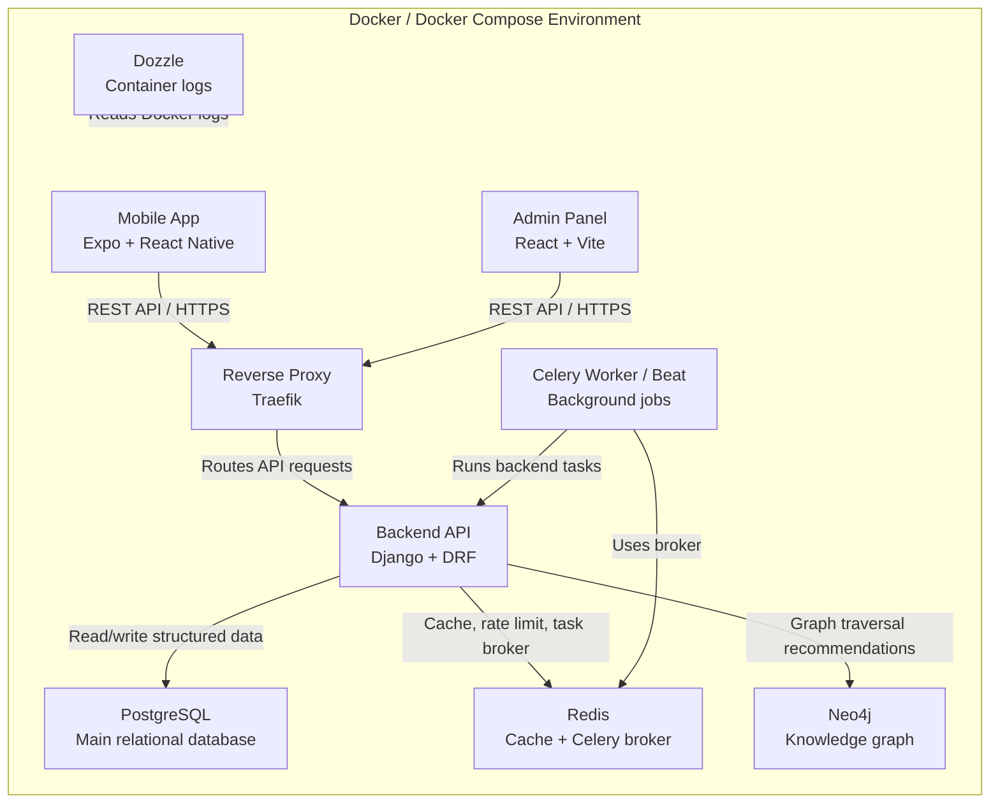
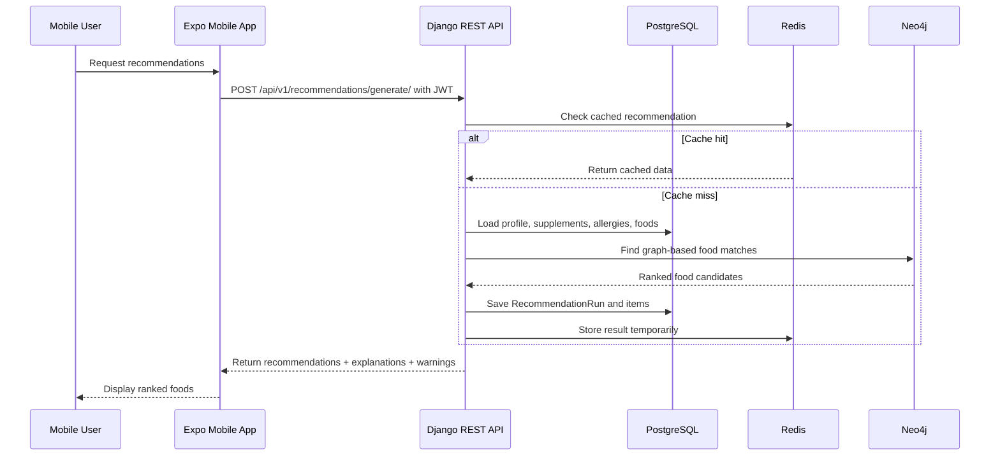
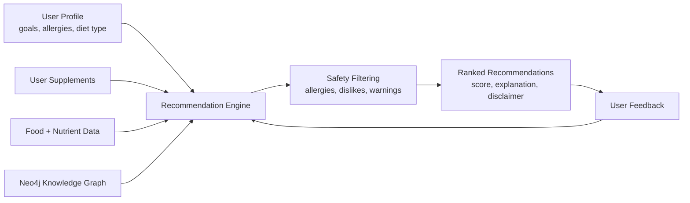
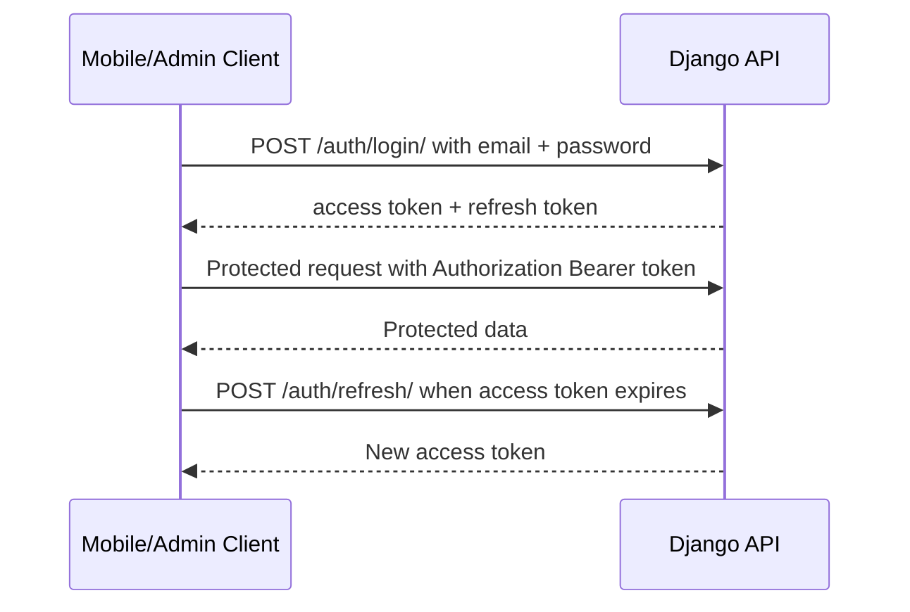
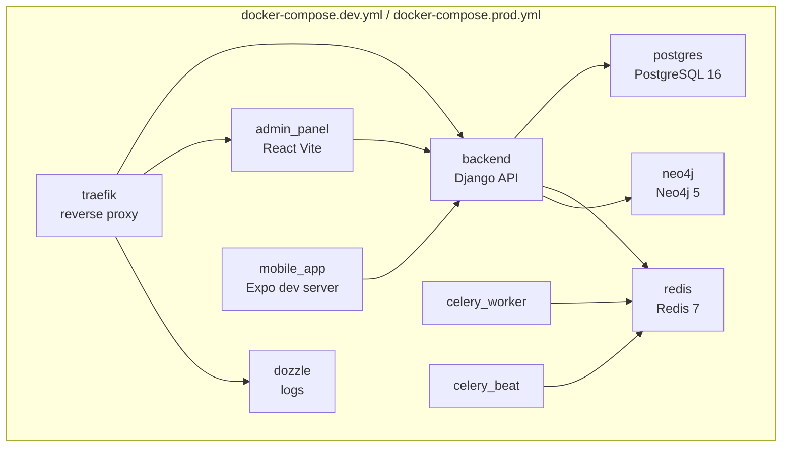

# I-NutriGuide Tech Stack and Architecture Summary

## 1. Project Overview

I-NutriGuide is an AI-powered nutrition recommendation system. It recommends foods that complement a user's supplements while respecting allergies, disliked foods, dietary restrictions, goals, and safety rules.

The project is organized as a monorepo:

```txt
apps/
  backend/       Django REST API
  mobile-app/    Expo React Native app
  admin-panel/   React Vite dashboard
packages/
  shared-types/  Shared TypeScript contracts
infra/
  traefik/       Reverse proxy configuration
  scripts/       Deployment and maintenance scripts
docs/            Documentation
```

## 2. Global System Architecture

Architecture graphic file:

```txt
docs/system-architecture-diagram.svg
```



The mobile app and admin panel never access databases directly. They communicate with the Django API, and the backend manages all data, authentication, business logic, recommendations, caching, and external integrations.

## 3. Main Tech Stack

| Layer | Technology | Why We Used It |
|---|---|---|
| Mobile app | Expo + React Native | Build a mobile app for users with one React-based codebase. |
| Admin panel | React + Vite | Build a fast web dashboard for admins. |
| Frontend language | TypeScript | Reduce errors and make API data easier to manage. |
| API client | Axios | Send HTTP requests and automatically attach JWT tokens. |
| Server state | React Query | Manage API loading, caching, errors, and refetching. |
| Local state | Zustand | Store authentication/session state simply. |
| Backend | Django | Provide models, routing, settings, admin tools, and business structure. |
| API framework | Django REST Framework | Expose backend features as REST endpoints. |
| Authentication | Simple JWT | Secure mobile and admin requests with access/refresh tokens. |
| Main database | PostgreSQL | Store users, profiles, foods, supplements, recommendations, feedback, and chats. |
| Cache / broker | Redis | Cache recommendations, rate-limit chat, and support Celery. |
| Background jobs | Celery | Run asynchronous or scheduled backend tasks. |
| Graph database | Neo4j | Model relations between users, foods, supplements, nutrients, allergies, and restrictions. |
| AI chat provider | Groq API | Generate conversational nutrition answers from backend-controlled context. |
| Reverse proxy | Traefik | Route production traffic to backend, admin, and logs services. |
| Containers | Docker Compose | Run the whole system locally and in deployment with repeatable services. |
| Logs | Dozzle | Inspect Docker container logs from a web UI. |

## 4. Backend Architecture

The backend is built with Django and Django REST Framework. It is divided into domain apps:

```txt
accounts         Users, profiles, allergies, restrictions, daily tracking
foods            Foods, categories, CIQUAL food data
nutrients        Nutrients and nutrient interactions
supplements      Supplements and user supplement intake
rules            Association rules / nutrition knowledge rules
recommendations  Recommendation generation, history, saved foods
feedback         User feedback on recommendations
analytics        Admin dashboard statistics
chat             AI chat sessions and messages
common           Shared utilities, Neo4j client, pagination
```

Important API examples:

```txt
POST /api/v1/auth/login/
POST /api/v1/auth/refresh/
GET  /api/v1/profile/
POST /api/v1/recommendations/generate/
GET  /api/v1/recommendations/history/
GET  /api/v1/admin/recommendations/
POST /api/v1/chat/messages/
```

## 5. Communication Flow



Simple example:

```txt
1. User takes Vitamin C.
2. The app sends the user's supplement profile to the backend.
3. The backend stores it in PostgreSQL.
4. Neo4j links: User -> Supplement -> Nutrient <- Food.
5. The recommender finds foods connected to useful nutrients.
6. The backend removes disliked or unsafe foods.
7. The app displays the recommended foods with explanations.
```

## 6. Recommendation System Design



The active recommender mainly uses Neo4j graph traversal. It searches relationships such as:

```txt
User -> TAKES_SUPPLEMENT -> Supplement
Supplement -> CONTAINS_NUTRIENT -> Nutrient
Food -> CONTAINS_NUTRIENT -> Nutrient
Food -> BELONGS_TO -> Category
User -> DISLIKES -> Food
```

This graph structure helps the system understand supplement-food relationships. If Neo4j does not return results, the backend falls back to PostgreSQL and returns active foods while still excluding known allergies or disliked foods.

## 7. Authentication and Security



Security choices:

- JWT protects mobile and admin API requests.
- Admin endpoints require admin permissions.
- CORS controls allowed frontend origins.
- Environment variables store secrets and service URLs.
- Recommendation and chat responses include educational safety disclaimers.

## 8. Docker and Deployment View



Docker Compose is important because it starts all required services together. The backend depends on PostgreSQL, Redis, and Neo4j. The admin panel and mobile app depend on the backend API.

Main local ports:

```txt
Backend API:  http://localhost:8000
Admin panel:  http://localhost:5173
Expo app:     http://localhost:8081
PostgreSQL:   localhost:5432
Redis:        localhost:6379
Neo4j:        localhost:7474 / 7687
Dozzle:       http://localhost:9999
```

## 9. Short Conclusion

I-NutriGuide uses a modern full-stack architecture. The mobile app and admin dashboard communicate with a Django REST API. PostgreSQL stores the main data, Redis improves performance and supports background processing, Neo4j powers graph-based nutrition recommendations, and Groq provides AI chat explanations. Docker Compose runs the complete system, while Traefik handles reverse-proxy routing for deployment.

This architecture is suitable because it separates responsibilities clearly: frontend clients handle user interaction, Django controls business logic and security, databases store specialized data, and the recommendation engine combines user profile, supplements, foods, graph relationships, and safety rules to produce explainable food recommendations.
